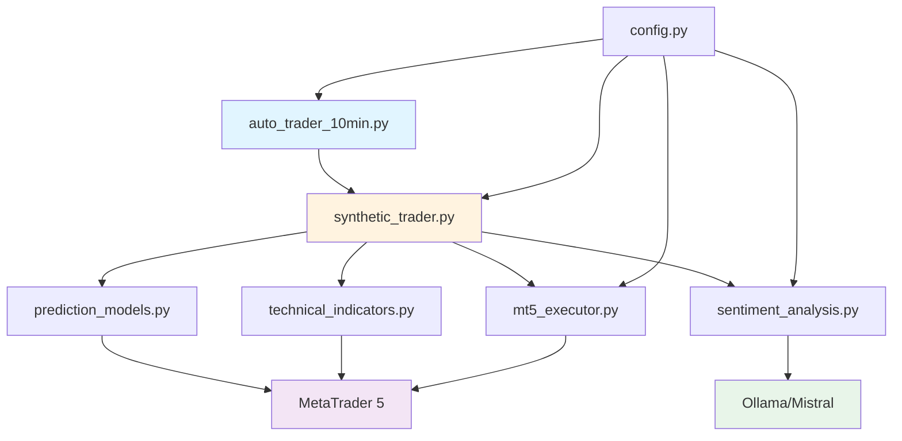
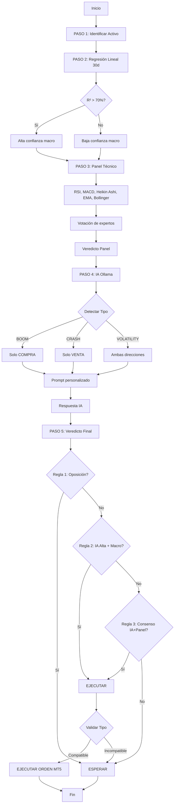

# 🧮 Documentación de Algoritmos - Deriv Trading Bot

## 📋 Índice

1. [Arquitectura General](#arquitectura-general)
2. [Sistema de 5 Pasos](#sistema-de-5-pasos)
3. [Algoritmos de Indicadores Técnicos](#algoritmos-de-indicadores-técnicos)
4. [Modelo de Regresión Lineal](#modelo-de-regresión-lineal)
5. [Sistema de IA con Ollama](#sistema-de-ia-con-ollama)
6. [Lógica de Validación](#lógica-de-validación)
7. [Ejecución de Órdenes](#ejecución-de-órdenes)
8. [Formulas Matemáticas](#formulas-matemáticas)

---

## 1. Arquitectura General

### Diagrama de Componentes



### Flujo de Datos

```
MetaTrader 5 (Datos históricos)
        ↓
[Paso 1] Identificación del Activo
        ↓
[Paso 2] Regresión Lineal (30 días, H1)
        ↓
[Paso 3] Panel de Expertos Técnicos (M5)
        ↓
[Paso 4] Análisis de IA (Ollama)
        ↓
[Paso 5] Veredicto Final + Validación
        ↓
Ejecución en MT5 (si hay consenso)
```

---

## 2. Sistema de 5 Pasos

### PASO 1: Identificación del Activo

**Archivo**: `synthetic_trader.py` (líneas 37-41)

**Algoritmo**:
```python
def identificar_activo(symbol):
    """
    Obtiene información básica del símbolo
    """
    metadata = {
        'simbolo': symbol,
        'mercado': 'Indices Sinteticos (Deriv)',
        'hora_local': datetime.now(),
        'timeframe_analysis': 'M5'
    }
    return metadata
```

**Propósito**:
- Registrar el activo bajo análisis
- Establecer contexto temporal
- Definir timeframe de trabajo

---

### PASO 2: Regresión Lineal (30 Días)

**Archivo**: `prediction_models.py`

#### Algoritmo

```python
def get_monthly_probability(df_history):
    """
    Análisis de tendencia macro mediante regresión lineal
    
    Entrada:
        df_history: DataFrame con datos horarios (H1) de 30 días
    
    Salida:
        {
            'tendencia': 'ALCISTA' | 'BAJISTA' | 'NEUTRO',
            'confianza': 0-100,
            'recomendacion': 'COMPRA' | 'VENTA' | 'ESPERAR'
        }
    """
    
    # 1. Preparar datos
    x = np.arange(len(df_history)).reshape(-1, 1)  # Índice temporal
    y = df_history['close'].values                  # Precios de cierre
    
    # 2. Ajustar modelo de regresión lineal
    model = LinearRegression()
    model.fit(x, y)
    
    # 3. Calcular coeficiente de determinación (R²)
    r2_score = model.score(x, y)
    confianza = int(r2_score * 100)
    
    # 4. Determinar tendencia según pendiente
    pendiente = model.coef_[0]
    
    if pendiente > 0.5:
        tendencia = "ALCISTA"
        recomendacion = "COMPRA"
    elif pendiente < -0.5:
        tendencia = "BAJISTA"
        recomendacion = "VENTA"
    else:
        tendencia = "NEUTRO"
        recomendacion = "ESPERAR"
    
    return {
        'tendencia': tendencia,
        'confianza': confianza,
        'recomendacion': recomendacion
    }
```

#### Fórmula Matemática

**Modelo de Regresión Lineal**:
```
y = β₀ + β₁x + ε

Donde:
- y = Precio de cierre
- x = Índice temporal (0, 1, 2, ..., n)
- β₀ = Intercepto
- β₁ = Pendiente (indica dirección de tendencia)
- ε = Error residual
```

**Coeficiente R²** (Bondad de ajuste):
```
R² = 1 - (SS_res / SS_tot)

SS_res = Σ(y_i - ŷ_i)²    # Suma de cuadrados residuales
SS_tot = Σ(y_i - ȳ)²       # Suma total de cuadrados

R² ∈ [0, 1]
- R² cercano a 1: Buen ajuste (tendencia clara)
- R² cercano a 0: Mal ajuste (sin tendencia)
```

**Umbral de Decisión**:
```
SI β₁ > 0.5:    ALCISTA
SI β₁ < -0.5:   BAJISTA
SI -0.5 ≤ β₁ ≤ 0.5:  NEUTRO
```

---

### PASO 3: Panel de Expertos Técnicos

**Archivo**: `technical_indicators.py`

#### 3.1 RSI (Relative Strength Index)

**Algoritmo**:
```python
def calcular_rsi(df, period=14):
    """
    RSI = 100 - (100 / (1 + RS))
    RS = Promedio de ganancias / Promedio de pérdidas
    """
    delta = df['close'].diff()
    
    # Separar ganancias y pérdidas
    gains = delta.where(delta > 0, 0)
    losses = -delta.where(delta < 0, 0)
    
    # Promedios móviles exponenciales
    avg_gain = gains.rolling(window=period).mean()
    avg_loss = losses.rolling(window=period).mean()
    
    # Calcular RS y RSI
    rs = avg_gain / avg_loss
    rsi = 100 - (100 / (1 + rs))
    
    return rsi.iloc[-1]
```

**Interpretación**:
```
RSI < 30:  SOBREVENTA → Señal de COMPRA
RSI > 70:  SOBRECOMPRA → Señal de VENTA
30 ≤ RSI ≤ 70:  NEUTRAL
```

**Fórmula**:
```
RSI = 100 - [100 / (1 + RS)]

RS = (Ganancia promedio de n períodos) / (Pérdida promedio de n períodos)

Ganancia_i = max(Precio_cierre_i - Precio_cierre_(i-1), 0)
Pérdida_i = max(Precio_cierre_(i-1) - Precio_cierre_i, 0)
```

---

#### 3.2 MACD (Moving Average Convergence Divergence)

**Algoritmo**:
```python
def calcular_macd(df):
    """
    MACD = EMA(17) - EMA(35)
    Signal = EMA(9) del MACD
    Histograma = MACD - Signal
    """
    # Calcular EMAs
    ema_12 = df['close'].ewm(span=17).mean()
    ema_26 = df['close'].ewm(span=35).mean()
    
    # Línea MACD
    macd_line = ema_12 - ema_26
    
    # Línea de señal
    signal_line = macd_line.ewm(span=9).mean()
    
    # Histograma
    histogram = macd_line - signal_line
    
    return macd_line.iloc[-1], signal_line.iloc[-1], histogram.iloc[-1]
```

**Interpretación**:
```
SI MACD > Signal:  ALCISTA → COMPRA
SI MACD < Signal:  BAJISTA → VENTA
SI MACD cruza Signal hacia arriba:  Señal fuerte de COMPRA
SI MACD cruza Signal hacia abajo:   Señal fuerte de VENTA
```

**Fórmulas**:
```
MACD = EMA₁₇ - EMA₃₅

Signal = EMA₉(MACD)

Histograma = MACD - Signal

EMA_t = (Precio_t × α) + (EMA_(t-1) × (1 - α))

α = 2 / (período + 1)
```

---

#### 3.3 Heikin Ashi

**Algoritmo**:
```python
def calcular_heikin_ashi(df):
    """
    Velas japonesas suavizadas para identificar tendencias
    """
    ha = df.copy()
    
    # Cierre Heikin Ashi
    ha['close'] = (df['open'] + df['high'] + df['low'] + df['close']) / 4
    
    # Apertura Heikin Ashi
    ha['open'] = (df['open'].shift(1) + df['close'].shift(1)) / 2
    ha['open'].iloc[0] = df['open'].iloc[0]
    
    # Máximo Heikin Ashi
    ha['high'] = ha[['open', 'close', 'high']].max(axis=1)
    
    # Mínimo Heikin Ashi
    ha['low'] = ha[['open', 'close', 'low']].min(axis=1)
    
    # Determinar color de la última vela
    ultima_vela = ha.iloc[-1]
    if ultima_vela['close'] > ultima_vela['open']:
        return "VERDE (Alcista)"
    else:
        return "ROJO (Bajista)"
```

**Interpretación**:
```
Velas VERDES consecutivas:  Tendencia ALCISTA fuerte
Velas ROJAS consecutivas:   Tendencia BAJISTA fuerte
Alternancia:                Sin tendencia clara
```

**Fórmulas**:
```
HA_Close = (Open + High + Low + Close) / 4

HA_Open = (HA_Open_(t-1) + HA_Close_(t-1)) / 2

HA_High = max(High, HA_Open, HA_Close)

HA_Low = min(Low, HA_Open, HA_Close)
```

---

#### 3.4 Estrategia de 4 Medias Móviles (EMAs 9, 15, 28, 37)

**Algoritmo**:
```python
def calculate_ema_alignment(prices):
    """
    Verifica la alineación perfecta de 4 EMAs para determinar tendencia fuerte.
    EMAs: 9, 15, 28, 37
    """
    ema9 = prices.ewm(span=9, adjust=False).mean()
    ema15 = prices.ewm(span=15, adjust=False).mean()
    ema28 = prices.ewm(span=28, adjust=False).mean()
    ema37 = prices.ewm(span=37, adjust=False).mean()
    
    c9, c15, c28, c37 = ema9.iloc[-1], ema15.iloc[-1], ema28.iloc[-1], ema37.iloc[-1]
    
    # Tendencia ALCISTA fuerte: Ordenadas de menor a mayor periodo
    if c9 > c15 > c28 > c37:
        return "COMPRA"
    # Tendencia BAJISTA fuerte: Ordenadas de mayor a menor periodo
    elif c9 < c15 < c28 < c37:
        return "VENTA"
    else:
        return "ESPERAR"
```

**Interpretación**:
```
EMA_9 > EMA_15 > EMA_28 > EMA_37:  ALCISTA Fuerte → COMPRA
EMA_9 < EMA_15 < EMA_28 < EMA_37:  BAJISTA Fuerte → VENTA
Cualquier otro orden:              Consolidación/Ruido → ESPERAR
```

---

#### 3.5 Bandas de Bollinger

**Algoritmo**:
```python
def calcular_bollinger(df, period=20, std_dev=2):
    """
    Banda Superior = SMA + (std_dev × σ)
    Banda Inferior = SMA - (std_dev × σ)
    """
    sma = df['close'].rolling(window=period).mean()
    std = df['close'].rolling(window=period).std()
    
    upper_band = sma + (std_dev * std)
    lower_band = sma - (std_dev * std)
    
    precio_actual = df['close'].iloc[-1]
    
    if precio_actual <= lower_band.iloc[-1]:
        return "SOBREVENTA (toca banda inferior)"
    elif precio_actual >= upper_band.iloc[-1]:
        return "SOBRECOMPRA (toca banda superior)"
    else:
        return "DENTRO DEL RANGO"
```

**Interpretación**:
```
Precio toca banda inferior:   Posible REBOTE → COMPRA
Precio toca banda superior:   Posible CORRECCIÓN → VENTA
Precio en el centro:          Sin señal clara
```

**Fórmulas**:
```
Banda_Media = SMA(n)

Banda_Superior = SMA(n) + (k × σ)

Banda_Inferior = SMA(n) - (k × σ)

σ = √[Σ(x_i - μ)² / n]  (Desviación estándar)

Donde:
- n = período (típicamente 20)
- k = número de desviaciones (típicamente 2)
- μ = media
```

---

#### 3.6 Estocástico (K5, D4, Slowing 2)

**Algoritmo**:
```python
def calculate_stochastic(df, k_period=5, d_period=4, slowing=2):
    # Lowest Low y Highest High para periodo K
    low_min = df['low'].rolling(window=k_period).min()
    high_max = df['high'].rolling(window=k_period).max()
    
    # Raw %K
    k_raw = 100 * ((df['close'] - low_min) / (high_max - low_min))
    
    # Smooth %K (Slowing)
    k_line = k_raw.rolling(window=slowing).mean()
    
    # %D (Signal line) - No se usa para señal directa aquí, solo niveles
    # d_line = k_line.rolling(window=d_period).mean()
    
    k_val = k_line.iloc[-1]
    
    if k_val < 20:
        return "COMPRA"  # Sobreventa
    elif k_val > 80:
        return "VENTA"   # Sobrecompra
    else:
        return "ESPERAR"
```

**Interpretación**:
```
%K < 20:  Sobreventa → Posible rebote alcista → COMPRA
%K > 80:  Sobrecompra → Posible corrección bajista → VENTA
20-80:    Zona neutral → ESPERAR
```

---

#### 3.7 Micro Soportes y Resistencias

**Algoritmo**:
```python
def calculate_micro_sr(df, window=10):
    # Busca mínimos y máximos locales de 10 periodos
    recent_low = min(last_10_lows)
    recent_high = max(last_10_highs)
    current_close = close_price
    
    # Umbral de cercanía (ej. 0.05%)
    threshold = current_close * 0.0005 
    
    if abs(current_close - recent_low) <= threshold:
        return "COMPRA" # Rebote en soporte
    elif abs(current_close - recent_high) <= threshold:
        return "VENTA" # Rechazo en resistencia
    else:
        return "ESPERAR"
```

---

#### 3.8 Análisis de Volatilidad

**Algoritmo**:
```python
def calculate_volatility_analysis(df, atr_period=14):
    # Compara ATR actual con su media móvil (SMA 20)
    current_atr = ATR(14)
    avg_atr = SMA(ATR(14), 20)
    
    is_high_vol = current_atr > avg_atr
    
    # Si hay alta volatilidad, sigue la tendencia de la SMA 20
    if is_high_vol:
        if current_close > SMA(20):
            return "COMPRA"
        else:
            return "VENTA"
    else:
        return "ESPERAR" # Baja volatilidad
```

---

#### 3.9 Análisis de Volumen

**Algoritmo**:
```python
def calculate_volume_analysis(df, window=20):
    # Compara volumen promedio de velas verdes vs rojas
    avg_vol_green = mean(volume_green_candles)
    avg_vol_red = mean(volume_red_candles)
    
    if avg_vol_green > avg_vol_red * 1.1:
        return "COMPRA" # Presión compradora
    elif avg_vol_red > avg_vol_green * 1.1:
        return "VENTA" # Presión vendedora
    else:
        return "ESPERAR"
```

---

#### 3.10 Algoritmo de Consenso del Panel

**Archivo**: `technical_indicators.py`

```python
def get_technical_summary(df):
    """
    Combina 9 expertos y genera veredicto
    """
    # ... Cálculo de indicadores ...
    
    # Votación
    experts = {
        "RSI": ...,
        "EMA_CROSS": ...,
        "MACD": ...,
        "BOLLINGER": ...,
        "HEIKIN_ASHI": ...,
        "STOCHASTIC": ...,
        "MICRO_SR": ...,
        "VOLATILITY": ...,
        "VOLUME": ...
    }
    
    buys = count(experts == "COMPRA")
    sells = count(experts == "VENTA")
    
    # Mayoría simple de 9 expertos (Umbral = 5)
    if buys >= 5: veredicto = "ALCISTA"
    elif sells >= 5: veredicto = "BAJISTA"
    else: veredicto = "NEUTRAL"
    
    confianza = (max(buys, sells) / 9) * 100
    
    return ...
```

**Algoritmo de Votación Actualizado**:
```
Total_expertos = 9

Votos_COMPRA = Σ(expertos que votan COMPRA)
Votos_VENTA = Σ(expertos que votan VENTA)

Confianza = (max(Votos) / 9) × 100

SI Votos_COMPRA ≥ 5:
    Veredicto = "ALCISTA"
SI Votos_VENTA ≥ 5:
    Veredicto = "BAJISTA"
SINO:
    Veredicto = "NEUTRAL"
```

---

## 3. Análisis de IA (Paso 4)

**Archivo**: `sentiment_analysis.py`

### Algoritmo de IA con Ollama

```python
def analyze_price_action(symbol, context_data):
    """
    Análisis mediante IA local (Ollama/Mistral)
    con reglas específicas por tipo de activo
    """
    
    # 1. Detectar tipo de símbolo
    symbol_upper = symbol.upper()
    tipo_activo, reglas = detectar_tipo_activo(symbol_upper)
    
    # 2. Construir prompt personalizado
    prompt = f"""
    Estás analizando {symbol} ({tipo_activo}).
    
    {reglas}
    
    CONTEXTO TÉCNICO:
    {context_data}
    
    Responde ESTRICTAMENTE en formato JSON:
    {{
        "señal": "COMPRA/VENTA/ESPERAR",
        "confianza": "0-100",
        "razon": "Explicación técnica"
    }}
    """
    
    # 3. Consultar a Ollama
    response = requests.post(
        OLLAMA_URL,
        json={
            "model": OLLAMA_MODEL,
            "prompt": prompt,
            "stream": False,
            "format": "json"
        },
        timeout=60
    )
    
    # 4. Parsear respuesta
    if response.status_code == 200:
        ia_text = response.json().get("response", "")
        return json.loads(ia_text)
    
    return {"señal": "ESPERAR", "error": "IA no disponible"}
```

### Reglas por Tipo de Activo

```python
def detectar_tipo_activo(symbol_upper):
    """
    Determina el tipo de activo y sus reglas
    """
    if symbol_upper.startswith('B') or 'BOOM' in symbol_upper:
        return "BOOM", """
        ⚠️ REGLA BOOM: SOLO señales de COMPRA
        - Busca confluencia alcista
        - Ignora señales bajistas
        """
    
    elif symbol_upper.startswith('C') or 'CRASH' in symbol_upper:
        return "CRASH", """
        ⚠️ REGLA CRASH: SOLO señales de VENTA
        - Busca confluencia bajista
        - Ignora señales alcistas
        """
    
    elif 'XAU' in symbol_upper or 'GOLD' in symbol_upper:
        return "XAUUSD", """
        ⚠️ REGLA XAUUSD: Requiere >75% confianza
        - Spread mayor, necesita más confirmación
        - Ambas direcciones permitidas
        """
    
    # ... más tipos
```

---

## 4. Veredicto Final (Paso 5)

**Archivo**: `synthetic_trader.py`

### Algoritmo de Consolidación

```python
def veredicto_final(reg_res, tech, ai_res, symbol):
    """
    Combina los 3 análisis y valida compatibilidad
    """
    
    # Extraer direcciones
    reg_dir = reg_res['tendencia']        # PASO 2
    ai_signal = ai_res.get('señal')       # PASO 4
    panel_dir = tech['veredicto_matematico']  # PASO 3
    ai_conf = ai_res.get('confianza', 0)
    
    # REGLA 1: Oposición Directa → BLOQUEO
    if (reg_dir == "ALCISTA" and ai_signal == "VENTA") or \
       (reg_dir == "BAJISTA" and ai_signal == "COMPRA"):
        return "ESPERAR", "IA y Regresión OPUESTAS"
    
    # REGLA 2: Alta Confianza IA + Regresión Alineada → EJECUTAR
    if ai_conf >= 70:
        if (ai_signal == "COMPRA" and reg_dir == "ALCISTA") or \
           (ai_signal == "VENTA" and reg_dir == "BAJISTA"):
            return ai_signal, f"Alta confianza IA ({ai_conf}%) con Macro"
    
    # REGLA 3: Consenso IA + Panel → EJECUTAR
    if ai_signal == "COMPRA" and panel_dir == "ALCISTA":
        return "COMPRA", "Consenso IA y Panel"
    elif ai_signal == "VENTA" and panel_dir == "BAJISTA":
        return "VENTA", "Consenso IA y Panel"
    
    # Sin consenso
    return "ESPERAR", "Sin confluencia clara"
```

### Validación por Tipo de Activo

```python
def validar_compatibilidad(accion, symbol):
    """
    Valida que la señal sea compatible con el tipo de activo
    """
    symbol_upper = symbol.upper()
    
    if accion == "COMPRA":
        # Bloquear COMPRA en CRASH
        if symbol_upper.startswith('C') or 'CRASH' in symbol_upper:
            return False, "COMPRA NO permitida en CRASH"
    
    elif accion == "VENTA":
        # Bloquear VENTA en BOOM
        if symbol_upper.startswith('B') or 'BOOM' in symbol_upper:
            return False, "VENTA NO permitida en BOOM"
    
    return True, "Señal compatible"
```

---

## 5. Ejecución de Órdenes

**Archivo**: `mt5_executor.py`

### Algoritmo de Ejecución

```python
def open_trade(action_type, symbol, lot_size, sl_pips, tp_pips):
    """
    Ejecuta orden de mercado en MT5
    """
    
    # 1. Obtener información del símbolo
    symbol_info = mt5.symbol_info(symbol)
    point = symbol_info.point
    
    # 2. Obtener precio actual
    if action_type == 'COMPRA':
        price = mt5.symbol_info_tick(symbol).ask
        order_type = mt5.ORDER_TYPE_BUY
    else:
        price = mt5.symbol_info_tick(symbol).bid
        order_type = mt5.ORDER_TYPE_SELL
    
    # 3. Calcular SL y TP
    if action_type == 'COMPRA':
        sl = price - (sl_pips * 10 * point)
        tp = price + (tp_pips * 10 * point)
    else:
        sl = price + (sl_pips * 10 * point)
        tp = price - (tp_pips * 10 * point)
    
    # 4. Construir solicitud
    request = {
        "action": mt5.TRADE_ACTION_DEAL,
        "symbol": symbol,
        "volume": lot_size,
        "type": order_type,
        "price": price,
        "sl": sl,
        "tp": tp,
        "magic": 123456,
        "comment": "Bot Trader",
        "type_time": mt5.ORDER_TIME_GTC,
        "type_filling": mt5.ORDER_FILLING_IOC
    }
    
    # 5. Enviar orden
    result = mt5.order_send(request)
    
    return result.retcode == mt5.TRADE_RETCODE_DONE
```

### Cálculo de SL y TP

```
Para COMPRA:
    SL = Precio_Actual - (SL_pips × 10 × point)
    TP = Precio_Actual + (TP_pips × 10 × point)

Para VENTA:
    SL = Precio_Actual + (SL_pips × 10 × point)
    TP = Precio_Actual - (TP_pips × 10 × point)

Donde:
- point = Tamaño mínimo de cambio de precio
- ×10 = Conversión de pips a puntos (para índices sintéticos)
```

---

## 6. Resumen de Formulas Clave

### Regresión Lineal
```
y = β₀ + β₁x
R² = 1 - (SS_res / SS_tot)
```

### RSI
```
RSI = 100 - [100 / (1 + RS)]
RS = Ganancia_promedio / Pérdida_promedio
```

### MACD
```
MACD = EMA₁₂ - EMA₂₆
Signal = EMA₉(MACD)
```

### Heikin Ashi
```
HA_Close = (O + H + L + C) / 4
HA_Open = (HA_Open_previo + HA_Close_previo) / 2
```

### Bandas de Bollinger
```
BB_Superior = SMA(n) + (k × σ)
BB_Inferior = SMA(n) - (k × σ)
```

### Algoritmo Panel
```
Confianza = (Votos_máximos / Total_expertos) × 100
```

---

## 7. Diagrama de Flujo Completo



---

## 8. Complejidad Computacional

| Componente | Complejidad | Tiempo Estimado |
|-----------|-------------|-----------------|
| Regresión Lineal | O(n) | <1 segundo |
| RSI | O(n) | <0.5 segundos |
| MACD | O(n) | <0.5 segundos |
| Heikin Ashi | O(n) | <0.5 segundos |
| EMA | O(n) | <0.5 segundos |
| Bollinger | O(n) | <0.5 segundos |
| Panel Completo | O(n) | ~2 segundos |
| IA (Ollama) | O(1) * | 3-10 segundos |
| **Total por activo** | - | **5-15 segundos** |

\* Depende de la velocidad del hardware y modelo IA

---

## ✅ Conclusión

Este sistema combina:
- **Análisis macro** (Regresión Lineal)
- **Análisis técnico** (5 expertos)
- **Inteligencia Artificial** (Ollama)
- **Validación multinivel** (Tipo de activo + Consensus)

Para generar señales de trading robustas y validadas.

**Documentación técnica completa! 🎯**
