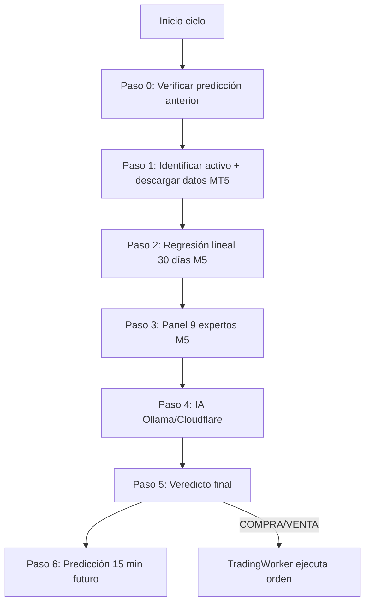

# Manual de Programación — Bot Trader (Deriv / MT5)

Este documento explica **cómo funciona el código**, **dónde tocar los cálculos** y **qué mejorar**. Está basado en el código fuente actual, no solo en la documentación antigua del repo.

---

## 1. Visión general

El proyecto tiene **dos rutas de ejecución** que comparten los mismos módulos de análisis pero difieren en arquitectura y algunos parámetros:

| Ruta | Entrada | Uso |
|------|---------|-----|
| **GUI (recomendada)** | `main.py` | App PyQt6 con dashboard, workers por símbolo, SQLite |
| **CLI legacy** | `auto_trader_10min.py` → `synthetic_trader.py` | Sesión automática sin interfaz, log a Excel |

```
main.py
  └── MainWindow (views/)
        └── MainController (controllers/)
              ├── Database (trading_bot.db)
              ├── MT5Connection (singleton)
              └── Por cada símbolo:
                    SymbolController → TradingWorker (QThread)
                          └── TradingAlgorithm.analyze_symbol()
```

**Patrón:** MVC (Views ↔ Controllers ↔ Models) + workers en hilos separados por símbolo.

---

## 2. Arranque de la aplicación GUI

**Archivo:** `main.py`

**Secuencia al iniciar (`MainController`):**

1. Abre `trading_bot.db` (SQLite).
2. Conecta MT5 con credenciales de la BD; si no hay, usa `config.py`.
3. Carga símbolos activos de la tabla `symbols`.
4. Crea una `SymbolCard` + `SymbolController` + `TradingWorker` por símbolo.
5. Timer cada 30 s para vigilar meta de ganancia diaria.

**Ejecutar:**

```bash
python main.py
```

---

## 3. Pipeline de análisis (6 pasos reales)

El cerebro está en `models/trading_algorithm.py`. Aunque el docstring dice "5 pasos", el flujo real tiene **6**:



---

### Paso 0 — Aprendizaje predictivo (antes del análisis)

**Archivo:** `models/trading_algorithm.py` → `_verify_previous_prediction()`

**Qué hace:** Lee la última predicción guardada en `analysis_log` y la compara con el precio actual.

| Parámetro | Valor actual | Dónde cambiar |
|-----------|--------------|---------------|
| Tolerancia de acierto | **50 pips** | Línea 184: `accuracy_threshold = 50` |
| Ajuste de confianza | **±5%** | Línea 200: `adjustment = +5 if was_accurate else -5` |

**Lógica:**

- Predicción **alcista** → acierto si el precio no cayó más de 50 pips.
- Predicción **bajista** → acierto si el precio no subió más de 50 pips.
- **Consolidación** → acierto si está dentro de ±50 pips.

Este ajuste se suma a la confianza final en el Paso 5.

---

### Paso 1 — Identificación y datos

**Archivo:** `models/trading_algorithm.py`

**Detección de tipo de activo** (`_detect_asset_type`):

- `BOOM`, `CRASH`, `STEP_RISE`, `STEP_DROP`, `VOLATILITY`, `XAUUSD`, `GENERIC`

**Descarga de datos MT5:**

| Dataset | Timeframe | Cantidad | Función |
|---------|-----------|----------|---------|
| Técnico (panel) | M5 | **200 velas** (~16.7 h) | `_get_recent_data(symbol, n=200)` |
| Regresión macro | M5 | **8640 velas** (30 días × 288/día) | `_get_history_data(symbol, days=30)` |

**Para cambiar el período de regresión**, edita `_get_history_data()` en `models/trading_algorithm.py`:

```python
def _get_history_data(self, symbol: str, days: int = 30) -> Optional[pd.DataFrame]:
    n = days * 288  # 30 días = 8640 velas M5
    return self.mt5_conn.get_market_data(symbol, mt5.TIMEFRAME_M5, n)
```

> **Importante:** El ajuste `regression_period` de la GUI se guarda en BD pero **no se lee aquí**. Está hardcodeado a 30 días.

---

### Paso 2 — Regresión lineal (tendencia macro)

**Archivo:** `prediction_models.py`

**Fórmula:**

```
y = slope × x + intercept    (x = índice de vela, y = precio close)
R² = 1 - Σ(y - ŷ)² / Σ(y - ȳ)²
```

**Reglas de salida:**

```python
recomendacion = "ESPERAR"
if r_sq > 0.4:  # Solo recomendamos si hay ajuste mínimo
    recomendacion = "COMPRAR" if slope > 0 else "VENDER"

return {
    "tendencia": "ALCISTA" if slope > 0 else "BAJISTA",
    "confianza": round(r_sq * 100, 2),
    "recomendacion": recomendacion
}
```

| Parámetro | Valor | Archivo / línea |
|-----------|-------|-----------------|
| Umbral R² mínimo | **0.4 (40%)** | `prediction_models.py:19` |
| Dirección | `slope > 0` → ALCISTA | `prediction_models.py:23` |

**Para ajustar:** cambia `0.4` por otro valor (ej. `0.5` = más estricto, `0.3` = más permisivo).

**Diferencia CLI vs GUI:** El CLI (`synthetic_trader.py`) usa **H1** para regresión; la GUI usa **M5**. El mismo símbolo puede dar tendencias distintas según la ruta.

---

### Paso 3 — Panel de 9 expertos técnicos

**Archivo:** `technical_indicators.py` → `get_technical_summary()`

Cada experto vota: `COMPRA`, `VENTA` o `ESPERAR`.

#### Tabla de expertos y umbrales editables

| # | Experto | Períodos | Regla de voto | Líneas clave |
|---|---------|----------|---------------|--------------|
| E1 | RSI | 14 | COMPRA si < **35**, VENTA si > **65** | 211 |
| E2 | EMA Cross | 9/15/28/37 | Alineación total alcista/bajista | 54-67 |
| E3 | MACD | 17/35/9 | Línea > señal → COMPRA | 29-34, 213 |
| E4 | Bollinger | 20, ±2σ | Precio fuera de bandas | 36-39, 214 |
| E5 | Heikin Ashi | — | Última vela alcista/bajista | 48-52 |
| E6 | Estocástico | 5/4/2 | COMPRA < **20**, VENTA > **80** | 69-94, 211 |
| E7 | Micro S/R | 10 velas | Cerca de soporte/resistencia (0.05% precio) | 96-115 |
| E8 | Volatilidad | ATR 14 | Alta vol → sigue SMA20 | 117-135 |
| E9 | Volumen | 20 velas | Verde > rojo × **1.1** → COMPRA | 137-157 |

#### Veredicto del panel

```python
total_voters = 9
threshold = 5  # Mayoría

veredicto = "ALCISTA" if buys >= threshold else "BAJISTA" if sells >= threshold else "NEUTRAL"
votos_ganadores = max(buys, sells)
confianza = round((votos_ganadores / total_voters) * 100, 1)
```

| Parámetro | Valor | Dónde cambiar |
|-----------|-------|---------------|
| Votos necesarios | **5 de 9** | `technical_indicators.py:228` |
| Mínimo de velas | **40** | `technical_indicators.py:170` |
| Velas usadas (GUI) | **200** | `trading_algorithm.py:409` |

> El ajuste `expert_consensus` de la GUI se guarda en BD pero **no se usa**; el umbral está fijo en 5.

---

### Paso 4 — Análisis con IA

**Archivo:** `sentiment_analysis.py` → `analyze_price_action()`

**Proveedores:** Ollama local o Cloudflare Workers AI (`models/ai_provider.py`).

**Reglas por tipo de activo** (inyectadas en el prompt):

- **Boom** → solo COMPRA
- **Crash** → solo VENTA
- **Step Rise/Drop** → prioriza dirección del nombre
- **Volatility / XAUUSD** → COMPRA o VENTA según confluencia

**Timeout:** 60 segundos (`sentiment_analysis.py:106`).

**Salida esperada (JSON):**

```json
{"señal": "COMPRA/VENTA/ESPERAR", "confianza": 75, "razon": "..."}
```

**Para modificar el comportamiento de la IA:**

1. **Prompts y reglas por activo** → `sentiment_analysis.py` líneas 34-83.
2. **Modelo Ollama** → BD `ollama_model` o `config.py` `OLLAMA_MODEL`.
3. **Modelo Cloudflare** → BD `cloudflare_model`.
4. **Timeout** → `provider.query(prompt, timeout=60)` en línea 106.

> `enable_ia` de la GUI se guarda en BD pero **no se consulta** antes de llamar a la IA.

---

### Paso 5 — Veredicto final (decisión de trading)

**Archivo:** `models/trading_algorithm.py` líneas 530-671

Las reglas se evalúan **en este orden**:

```
1. Modo Scalper (si activo):
   - Boom + señal VENTA → ESPERAR
   - Crash + señal COMPRA → ESPERAR

2. Regla 0 (prioritaria):
   - ai_conf < min_confidence_ia (default 70%) → ESPERAR

3. Regla 1:
   - Regresión y IA en direcciones opuestas → ESPERAR

4. Regla 2:
   - ai_conf >= 70% Y alineado con regresión → EJECUTAR señal IA

5. Regla 3:
   - IA COMPRA + Panel ALCISTA → COMPRA
   - IA VENTA + Panel BAJISTA → VENTA

6. Default → ESPERAR

7. Validación Boom/Crash (_validate_signal_compatibility)

8. Cálculo confianza final:
   base = confianza IA (o panel si IA = 0)
   final = base + ajuste_predicción_anterior (±5%)

9. Bloqueo final:
   - final_confidence < confidence_threshold (default 50%) → ESPERAR
```

#### Parámetros del Paso 5 que SÍ funcionan (desde BD)

| Setting BD | Default | Efecto |
|------------|---------|--------|
| `min_confidence_ia` | 70 | Bloquea si IA < umbral |
| `confidence_threshold` | 50 | Bloqueo final (sin UI, solo BD) |
| `scalper_mode` | false | Filtra dirección en Boom/Crash |

#### Valores hardcodeados que puedes cambiar en código

| Valor | Línea | Descripción |
|-------|-------|-------------|
| `70` en Regla 2 | 592 | Umbral "alta confianza" para ejecución con regresión |
| `+5 / -5` | 200 | Ajuste por predicción acertada/fallida |

---

### Paso 6 — Predicción futura (15 minutos)

**Archivo:** `models/trading_algorithm.py` → `_get_prediction()`

- Pide a la IA predecir movimiento de **3-5 velas M5** (15 min).
- **Timeout: 10 segundos** (si falla, usa predicción neutral por defecto).
- Se guarda en `analysis_log` para el Paso 0 del siguiente ciclo.

---

## 4. Ejecución de órdenes (después del análisis)

**Archivo:** `workers/trading_worker.py` → `_execute_trade()`

### Flujo de ejecución

```
1. ¿Meta diaria alcanzada? (daily_profit_target) → abortar
2. Calcular lotaje dinámico (risk_percentage + sl_pips)
3. Obtener precio ask/bid
4. Calcular SL/TP en precio
5. Enviar orden vía MT5Connection.send_order()
6. Guardar en trade_history
```

### Fórmula de lotaje

**Archivo:** `models/mt5_connection.py` → `calculate_lot_size()`

```
risk_amount = balance × (risk_percentage / 100)
sl_distance_price = sl_pips × point
lot_size = risk_amount / (sl_distance_price × contract_size)
```

Luego se normaliza al `volume_step` del broker y se aplican mínimos:

- **Boom/Crash:** mínimo **0.20** lotes (línea 188).
- Otros: mínimo del símbolo en MT5.

### Cálculo SL/TP en precio

```python
if action == 'COMPRA':
    sl = price - (sl_pips * point)
    tp = price + (tp_pips * point)
else:  # VENTA
    sl = price + (sl_pips * point)
    tp = price - (tp_pips * point)
```

### SL/TP en pips (origen)

**Archivo:** `models/trading_algorithm.py` → `get_sl_tp_params()`

```python
if asset_type == "XAUUSD":
    sl_pips = 1500
else:
    sl_pips = 1500  # Índices sintéticos

tp_pips = int(sl_pips * risk_reward_ratio)  # default ratio = 3.0 → TP = 4500 pips
```

> Los valores `sl_synthetics` / `tp_synthetics` de la GUI **no se usan**. Siempre es 1500 × ratio.

### Parámetros de riesgo que SÍ funcionan

| Setting | Default | Efecto |
|---------|---------|--------|
| `risk_percentage` | 1.0% | Tamaño de lote |
| `risk_reward_ratio` | 3.0 | TP = SL × ratio |
| `daily_profit_target` | 0 | Detiene trading al alcanzar meta |
| `max_spread_pips` | 10 | Rechaza orden si spread alto (`mt5_connection.py`) |

---

## 5. Base de datos (`trading_bot.db`)

**Archivo:** `models/database.py`

| Tabla | Contenido |
|-------|-----------|
| `settings` | Todos los parámetros de configuración (JSON key/value) |
| `symbols` | Símbolos activos, tipo, lote, estado running |
| `analysis_log` | Resultado completo de cada análisis + predicción + acierto |
| `trade_history` | Operaciones abiertas (ticket, SL, TP, profit) |
| `execution_errors` | Errores MT5/worker con stack trace |

**Ciclo de aprendizaje:**

```
Ciclo N   → guarda prediction en analysis_log
Ciclo N+1 → _verify_previous_prediction() → marca ACERTADA/FALLIDA → ±5% confianza
```

---

## 6. Matriz de configuración: qué funciona y qué no

Esta tabla es crítica si vas a tocar parámetros desde la GUI.

### Conectados al código (cambiar en Ajustes → tiene efecto)

| Parámetro GUI | Efecto real |
|---------------|-------------|
| Credenciales MT5 | Conexión |
| `min_confidence_ia` | Bloqueo Paso 5 |
| `risk_percentage` | Lotaje |
| `risk_reward_ratio` | TP en pips |
| `daily_profit_target` | Para trading al alcanzar meta |
| `analysis_interval` | Segundos entre ciclos del worker |
| `scalper_mode` | Filtro Boom/Crash |
| `max_spread_pips` | Rechazo de órdenes |
| `ai_provider`, URLs, modelos | Proveedor IA |
| `enable_trailing_stop`, `trailing_*` | Solo si arrancas `MT5MonitorWorker` |

### Guardados en BD pero NO usados por el algoritmo

| Parámetro GUI | Estado |
|---------------|--------|
| `regression_period` | Hardcodeado 30 días |
| `regression_threshold` | No usado (R² usa 0.4 fijo) |
| `regression_timeframe` | No se guarda ni usa |
| `technical_period` | Hardcodeado 200 velas |
| `expert_consensus` | Hardcodeado 5 votos |
| `sl_synthetics`, `tp_synthetics`, `sl_xauusd`, `tp_xauusd` | Ignorados (usa 1500 fijo) |
| `enable_auto_trading` | Worker ejecuta siempre en COMPRA/VENTA |
| `enable_ia` | IA siempre se llama |

### Solo en BD (sin UI)

| Parámetro | Default | Efecto |
|-----------|---------|--------|
| `confidence_threshold` | 50 | Bloqueo final de confianza |

Para cambiarlo: editar directamente en SQLite o añadir campo en `settings_dialog.py`.

---

## 7. Mapa de archivos: dónde tocar cada cosa

```
CÁLCULOS MATEMÁTICOS
├── prediction_models.py      → Regresión lineal, umbral R²
├── technical_indicators.py   → Los 9 expertos, umbrales RSI/Stoch, consenso
└── models/trading_algorithm.py → Reglas de decisión, SL/TP, aprendizaje predictivo

IA / PROMPTS
├── sentiment_analysis.py     → Prompts por activo, timeout Paso 4
└── models/ai_provider.py     → Ollama / Cloudflare

EJECUCIÓN / RIESGO
├── workers/trading_worker.py → Loop, ejecución, guardado BD
├── models/mt5_connection.py  → Lotaje, spread, send_order
└── workers/trailing_stop_manager.py → Trailing (requiere monitor activo)

INTERFAZ / CONFIG
├── views/settings_dialog.py  → UI de parámetros
├── models/database.py        → Persistencia
└── config.py                 → Defaults estáticos, mapeo símbolos

LEGACY (CLI)
├── synthetic_trader.py       → Pipeline CLI (H1 para regresión)
├── auto_trader_10min.py      → Sesión 10 min
└── mt5_executor.py           → MT5 legacy (fórmula pips distinta)
```

---

## 8. Integraciones externas

| Integración | Protocolo | Uso |
|-------------|-----------|-----|
| **MetaTrader 5** | Paquete `MetaTrader5` | Datos de mercado, ticks, órdenes, posiciones |
| **Ollama** | HTTP `localhost:11434/api/generate` | LLM local (default: mistral) |
| **Cloudflare Workers AI** | HTTPS API v4 | LLM en la nube (alternativa) |
| **SQLite** | stdlib | Persistencia local (`trading_bot.db`) |
| **Excel** | `openpyxl` | Log opcional en ruta CLI (`trading_history.xlsx`) |

---

## 9. Mejoras prioritarias (ordenadas por impacto)

### Alta prioridad — bugs / comportamiento incorrecto

1. **Conectar settings de la GUI al algoritmo**
   - Leer `regression_period`, `technical_period`, `expert_consensus` desde BD en `trading_algorithm.py` y `technical_indicators.py`.
   - Usar `sl_synthetics`/`tp_synthetics` en `get_sl_tp_params()` en lugar del 1500 fijo.

2. **Respetar `enable_auto_trading`**
   - En `trading_worker.py` línea 106, añadir verificación antes de ejecutar órdenes.

3. **Arrancar `MT5MonitorWorker`**
   - Está implementado en `workers/mt5_monitor_worker.py` pero **nunca se inicia** desde `MainController`. Sin esto, el trailing stop no funciona aunque esté activado en ajustes.

4. **Unificar timeframes CLI vs GUI**
   - `synthetic_trader.py` usa H1; GUI usa M5. Unificar evita señales contradictorias.

5. **Fórmula de pips inconsistente**
   - Legacy `mt5_executor.py`: `sl_pips * 10 * point`
   - GUI `trading_worker.py`: `sl_pips * point`
   - Mismo número de "pips" = distancia distinta según la ruta.

### Media prioridad — robustez

6. **Credenciales en texto plano** — `config.py` tiene password MT5 y token Cloudflare. Migrar a `.env`.
7. **Cerrar trades en BD** — `close_trade()` no se llama desde workers; el historial puede quedar incompleto.
8. **`enable_ia`** — Consultar antes de Paso 4 y 6 para ahorrar tiempo si IA está desactivada.
9. **Tests unitarios** — Indicadores y reglas del Paso 5 no tienen tests.
10. **`confidence_threshold` en UI** — Añadir en pestaña Riesgo de `settings_dialog.py`.

### Baja prioridad — evolución

11. **Backtesting** — No existe módulo de simulación histórica.
12. **Módulos placeholder** — `models/technical_analysis.py`, `regression_model.py`, etc. están vacíos; confunden.
13. **Parsing JSON de IA** — Frágil; mejor usar schema validation o reintentos.
14. **StartupValidator** — Existe en `utils/startup_validator.py` pero `main.py` no lo ejecuta.

---

## 10. Guía rápida: "quiero cambiar X"

| Quiero... | Archivo | Qué editar |
|-----------|---------|------------|
| Hacer RSI más sensible | `technical_indicators.py:211` | Cambiar 35/65 por 30/70 |
| Exigir más consenso técnico | `technical_indicators.py:228` | `threshold = 6` (6 de 9) |
| Regresión más estricta | `prediction_models.py:19` | `r_sq > 0.5` |
| Más días de tendencia macro | `trading_algorithm.py:86` | `days * 288` con otro `days` o leer de BD |
| Menos confianza IA requerida | GUI → Riesgo → `min_confidence_ia` | O BD directamente |
| Ratio riesgo:beneficio 1:2 | GUI → Riesgo → `risk_reward_ratio` = 2.0 | |
| Arriesgar 0.5% por trade | GUI → Riesgo → `risk_percentage` = 0.5 | |
| Cambiar prompt de la IA | `sentiment_analysis.py` líneas 85-103 | |
| Analizar cada 60 s | GUI → Algoritmo → `analysis_interval` = 60 | |
| SL 800 pips en sintéticos | `trading_algorithm.py:718` | Cambiar `sl_pips = 1500` (hoy la GUI no controla esto) |
| Solo análisis sin operar | Código: implementar check de `enable_auto_trading` | Hoy no funciona desde GUI |

---

## 11. Dependencias y requisitos

```bash
pip install -r requirements_gui.txt   # GUI
pip install -r requirements.txt       # CLI + Excel
```

**Externos necesarios:**

- MetaTrader 5 instalado y logueado en cuenta Deriv.
- Ollama corriendo en `localhost:11434` (si usas IA local).
- O cuenta Cloudflare con Workers AI (alternativa cloud).

---

## 12. Referencia de clases y funciones clave

| Símbolo | Archivo |
|---------|---------|
| `TradingAlgorithm.analyze_symbol()` | `models/trading_algorithm.py` |
| `TradingAlgorithm.get_sl_tp_params()` | `models/trading_algorithm.py` |
| `get_technical_summary()` | `technical_indicators.py` |
| `get_monthly_probability()` / `calculate_linear_regression()` | `prediction_models.py` |
| `analyze_price_action()` / `query_ai()` | `sentiment_analysis.py` |
| `MT5Connection` (connect, send_order, calculate_lot_size) | `models/mt5_connection.py` |
| `TradingWorker` | `workers/trading_worker.py` |
| `TrailingStopManager` | `workers/trailing_stop_manager.py` |
| `MT5MonitorWorker` | `workers/mt5_monitor_worker.py` |
| `MainController` | `controllers/main_controller.py` |
| `SymbolController` | `controllers/symbol_controller.py` |
| `Database` | `models/database.py` |
| `AIProvider`, `get_ai_provider()` | `models/ai_provider.py` |
| `run_synthetic_analysis()` | `synthetic_trader.py` |
| `connect_mt5()` / `open_trade()` | `mt5_executor.py` (legacy) |

---

## Resumen ejecutivo

El bot combina **3 capas de decisión**:

1. **Matemática macro** (regresión 30 días M5).
2. **Panel técnico** (9 indicadores en M5, mayoría 5/9).
3. **IA** (confluencia + reglas por tipo de activo).

La decisión final prioriza la **confianza de la IA** y exige **alineación** con regresión o panel. Luego aplica **filtros de activo** (Boom/Crash) y **umbrales de confianza**.

El mayor riesgo al modificar el proyecto hoy no es el algoritmo en sí, sino que **varios parámetros de la GUI no están conectados al código**. Si ajustas algo en Ajustes y no ves cambio, consulta la matriz de la sección 6 antes de tocar código.

---

## Documentación relacionada

| Archivo | Contenido |
|---------|-----------|
| `README.md` | Introducción general |
| `ARQUITECTURA.md` | Diseño MVC |
| `ALGORITMOS.md` | Descripción de algoritmos (puede estar desactualizado) |
| `GUIA_PROGRAMACION.md` | Guía anterior de programación |
| `MANUAL_USUARIO.md` | Manual de usuario |
| `INSTALACION.md` | Instalación |
| `INSTRUCCIONES_EJECUCION.md` | Cómo ejecutar |

> **Nota:** Este manual (`MANUAL_PROGRAMACION.md`) refleja el estado actual del código fuente. Si hay discrepancia con otros documentos, priorizar este archivo y el código.
